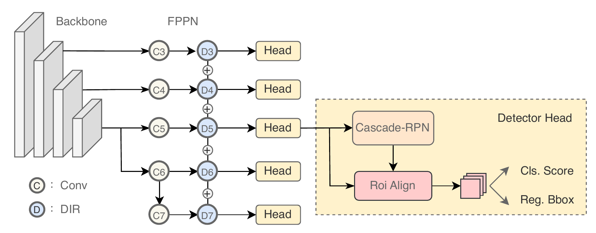

# A Multitype Feature Perception and Refined Network for Spaceborne Infrared Ship Detection

This repository contains the code (in PyTorch) for the paper: ([IEEE TGRS](http://https://ieeexplore.ieee.org/document/10352113))

If you use this code, please cite our paper. Please hit the star at the top-right corner. Thanks!
## Introduction

Spaceborne infrared ship detection holds immense research significance in both military and civilian domains. Nonetheless, the focus of research in this field remains primarily on optical and Synthetic Aperture Radar (SAR) images due to the confidentiality and limited accessibility of infrared data. The challenges in spaceborne ship detection arise from the long-distance capture and low signal-to-noise ratio of infrared images, which contribute to false alarm misclassifications. To handle this problem, this paper concentrates on enhancing information interaction during feature extraction to discern disparities between targets and backgrounds more effectively, and we propose a Multi-Type Feature Perception and Refined Network (MFPRN). Specifically, we propose a dual feature fusion scheme, which combines a Fast Fourier module used to obtain comprehensive receptive field and a lightweight MLP applied to capture the long-range feature dependencies. Besides, we adopt a Cascade Region Proposal Network to leverage high-quality region proposals for the prediction head. Through the extraction of rich features and refined candidate boxes, we successfully mitigate false alarms. Experimental results illustrate that our method significantly reduces false alarms for general detectors, culminating in state-of-the-art performance as demonstrated on the public ISDD baseline. 




## Dependencies

- Python==3.7.11
- PyTorch==1.10.1
- mmdetection==2.22.0
- mmcv==1.4.0
- numpy==1.21.2

## Installation

The basic installation follows with [mmdetection](https://github.com/mousecpn/mmdetection/blob/master/docs/get_started.md). It is recommended to use manual installation. 

## Datasets

**ISDD**: https://github.com/yaqihan-9898/ISDD

After downloading all datasets, create ISDD document.

```
$ cd data
$ mkdir ISDD
```

It is recommended to symlink the dataset root to `$data`.

```
ISDD
├── data
│   ├── ISDD
│   │   ├── JPEGImages
│   │   ├── ImgaeSets
│   │   ├── Annotations
```


## Train

```
$ python tools/train.py configs/mfprn/crpn_mfprn_r50_fpn_1x_isdd_voc.py
```

## Test

```
$ python tools/test.py configs/mfprn/crpn_mfprn_r50_fpn_1x_isdd_voc.py <path/to/checkpoints>
```

## Checkpoint

**isdd**: https://drive.google.com/file/d/1uLUUjuTU1OFsc_6HP9YJeRutRQ2Ssl5w/view?usp=drive_link


## Results


## Acknowledgement

Thanks MMDetection team for the wonderful open source project!

## Citation

```
@ARTICLE{Yuan2023mfprn,
  author={Yuan, Jieyu and Cai, Zhanchuan and Wang, Shiyu and Kong, Xiaoxi},
  journal={IEEE Transactions on Geoscience and Remote Sensing}, 
  title={A Multitype Feature Perception and Refined Network for Spaceborne Infrared Ship Detection}, 
  year={2024},
  volume={62},
  number={},
  pages={1-11},
  doi={10.1109/TGRS.2023.3341215}}
```

